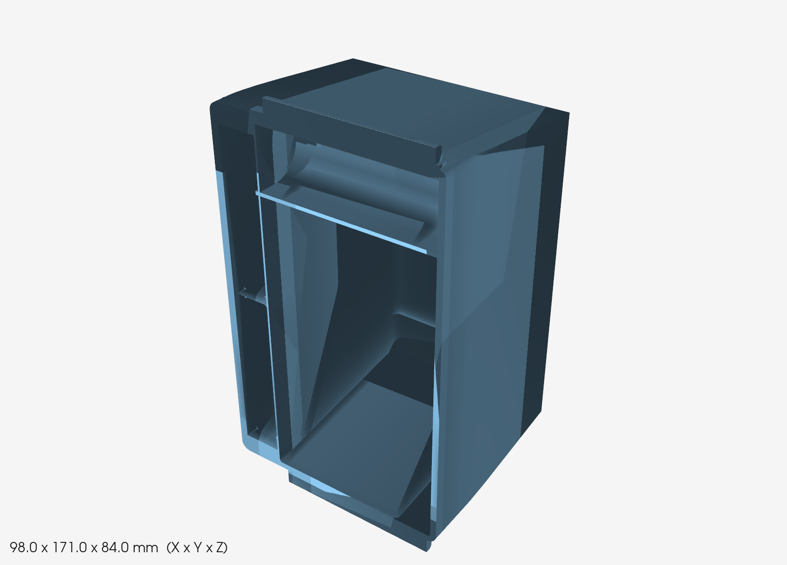
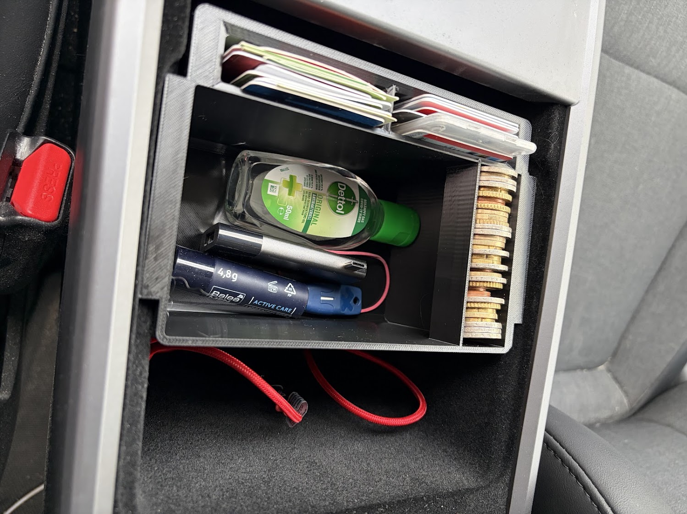
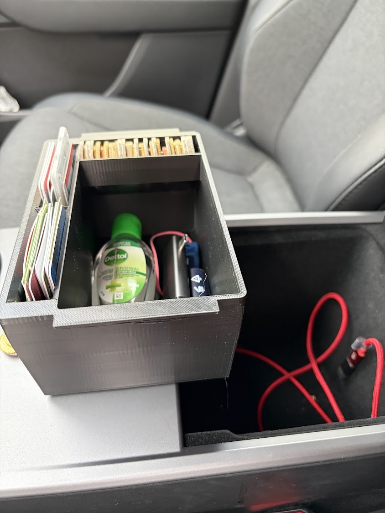

# TeslaBox – Einhänge-Einsatz Mittelkonsole (Model Y Juniper *Standard*)

*[English](README.en.md)*

Ein 3D-druckbarer Ablage-Einsatz für das tiefe Armlehnenfach der
Mittelkonsole eines Tesla Model Y "Juniper" Standard (2025/2026).
Parametrisches CAD-Modell (Python/CadQuery, echte Fillets, OCCT-Kernel)
statt eines fixen STLs – alle Maße lassen sich an das eigene Fahrzeug
anpassen.



Gedruckt und eingebaut:




## Was das ist

Das Fach hat oben einen umlaufenden **Falz** (eine kleine Stufe, ein
paar mm unter der Konsolenoberfläche, nur an den beiden Längsseiten).
Der Einsatz hat an beiden Längsseiten einen schmalen **Kragen**, der
genau in diesem Falz aufliegt: das Teil *hängt sich ein* und bleibt
bündig mit der Konsolenoberfläche, statt auf den Fachboden zu fallen.
Das reale Fach wird nach unten leicht enger – der Korpus ist deshalb
unterhalb des Kragens konisch verjüngt, damit er sich beim Einsetzen
leicht klemmt statt zu klappern.

Vorne sitzt ein massiver Block mit zwei aufrechten Schlitzen
nebeneinander für Kreditkarten (Scheckkarte hochkant, 85,6 × 54 mm).
An einer Seitenwand läuft oben eine offene **Münzrinne** für Kleingeld,
deren Unterseite als Keil geformt ist, damit sie beim FDM-Druck ganz
ohne Stützmaterial auskommt. Der Rest ist offene Ablage.

Alle Konstruktionsdetails (Maße, Begründungen, verworfene Alternativen)
stehen ausführlich in [`SPEC.md`](SPEC.md) – werkzeugunabhängig
beschrieben, nicht an CadQuery gebunden.

## ⚠️ Zuerst messen

Die Innenmaße des Fachs sind nirgends dokumentiert (Tesla veröffentlicht
sie nicht, Zubehörhändler nennen nur Außenmaße, und die *Standard*-Konsole
weicht von Premium/Performance ab). Vor dem Druck also die Parameter in
`teslabox.py` (Falzmaße, Fachtiefe, Eckradius) am eigenen Fahrzeug
überprüfen.

## Dateien

| Datei | Zweck |
|-------|-------|
| `teslabox.py` | Hauptmodell (CadQuery / OCCT) |
| `teslabox.stl` | fertiger Export zum Drucken |
| `teslabox_iso.png` | Vorschaubild (oben) |
| `SPEC.md` | ausführliche, werkzeugunabhängige Objektbeschreibung |
| `render.py` | VTK-Vorschaubilder aus STL erzeugen (`render.py <stl> <png> [az] [el]`) |

## Toolchain (einmalig)

```bash
curl -sSL https://bootstrap.pypa.io/get-pip.py -o /tmp/get-pip.py
python3 -m venv /tmp/cadenv
/tmp/cadenv/bin/python /tmp/get-pip.py
/tmp/cadenv/bin/pip install --only-binary :all: cadquery
```

```bash
/tmp/cadenv/bin/python teslabox.py
```

## Wichtigste Parameter in `teslabox.py`

| Parameter | Zweck |
|-----------|-------|
| `FALZ_BREITE`, `FALZ_TIEFE` | gemessene Falz-Öffnung / Falz-Stufentiefe |
| `FACH_BREITE`, `FACH_TIEFE` | gemessene Innenmaße des Fachs |
| `ECK_RADIUS` | gemessener Innen-Eckradius |
| `GESAMT_LAENGE` | Baulänge des Einsatzes in X (das Fach ist länger – der Einsatz belegt nur den vorderen Teil) |
| `VORNE_FREI` | Freiraum vorne ohne Kragen (Platz für die Kartenslots) |
| `KORPUS_HOEHE` | Gesamthöhe des Einsatzes |
| `WAND`, `BODEN` | Wand-/Bodenstärke |
| `N_SLOT`, `SLOT_X_DICKE`, `SLOT_Y_LAENGE`, `SLOT_TIEFE` | Anzahl/Maße der Kartenslots |
| `MUENZE_R`, `MUENZE_GERADE` | Querschnitt der Münzrinne |
| `BODEN_VERJUENGUNG` | Konus je Seite am Boden, damit der Einsatz klemmt |

## Druck

PETG (hitzefest fürs aufgeheizte Auto), 0,2 mm, 3 Wände, 12 % Infill,
kein Support. Optional dünne Filz-/TPE-Streifen unter den Kragen gegen
Klappern.
